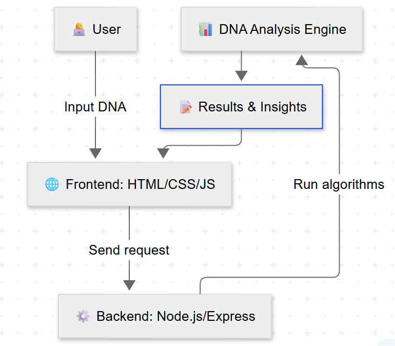

🌐 GenomicVision: Decoding Life Through Code

A Next-Gen Web Platform for DNA Sequence Analysis

📖 Overview

GenomicVision is an interactive, web-based platform designed to empower users to analyze DNA sequences in an intuitive and meaningful way. By combining dynamic programming algorithms with a clean, user-friendly interface, GenomicVision allows researchers, students, and bioinformatics enthusiasts to explore:

The longest common subsequences (LCS) between DNA samples

Evolutionary relationships through comparative sequence analysis

Genetic mutations and sequence mismatches

Functional insights into genetic data

Whether you are learning genetics or conducting bioinformatics research, GenomicVision provides a simple yet powerful tool for DNA analysis.

🚀 Features

🧬 DNA Sequence Comparison – Compare two DNA sequences and compute their LCS.

🌱 Evolutionary Analysis – Analyze genetic similarities to infer evolutionary relationships.

⚡ Mutation Detection – Identify mismatches and potential mutations in DNA sequences.

🔎 Functional Insights – Understand the biological significance of DNA variations.

💻 User-Friendly UI – Clean, interactive web interface for seamless analysis.

🛠️ Tech Stack

Frontend

HTML5 – Structure and layout

CSS3 – Styling and responsive design

JavaScript (Vanilla JS) – Interactivity, validation, and DNA analysis algorithms

Backend (optional for future expansion)

Node.js – Server-side DNA analysis

Express.js – API handling for scalable requests

Other Tools

**Mermaid – For architecture and workflow diagrams**

🏗️ Architecture

GenomicVision follows a client-server model:

Frontend: Captures DNA sequences and displays results dynamically.

Backend: Processes advanced analysis like mutation tracking and algorithm execution.

Algorithms: Uses dynamic programming to compute LCS and detect genetic mutations.

🙌 Acknowledgments

Special thanks to all mentors, peers, and the bioinformatics community for their guidance and inspiration during this project.

📬 Contact

👨‍💻 Developed by Yajat
📧 Email: vermayajat1@gmail.com

🔗 Links

GitHub Repository: https://github.com/vermayajat/GenomicVision

Live Demo: https://vermayajat.github.io/GenomicVision

✨ GenomicVision bridges the gap between biology and technology, helping you decode life — one sequence at a time.
